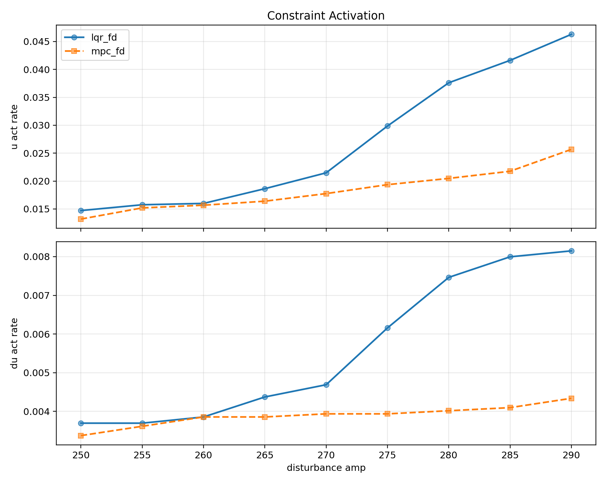
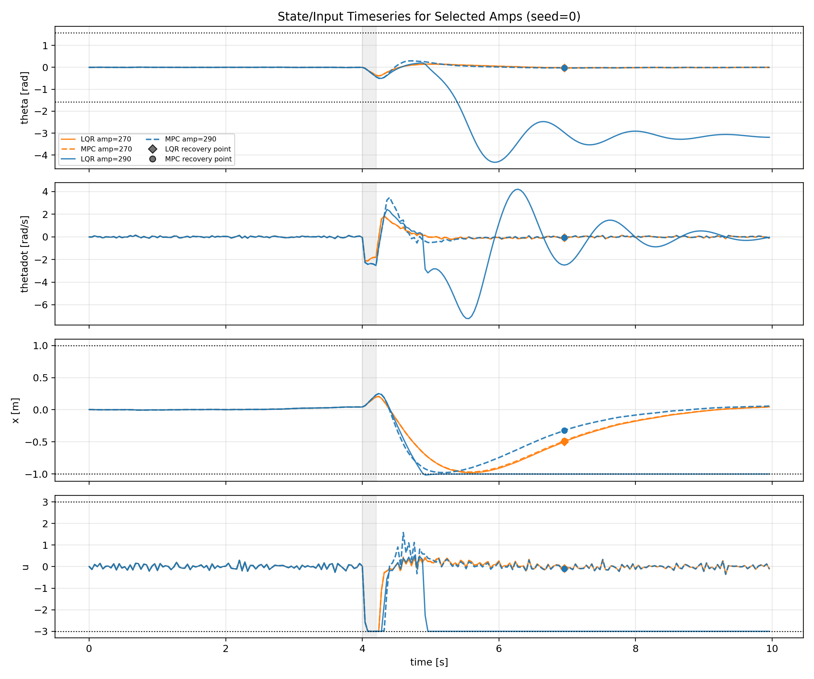
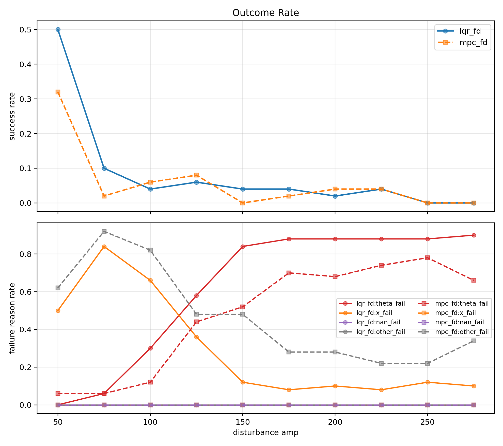
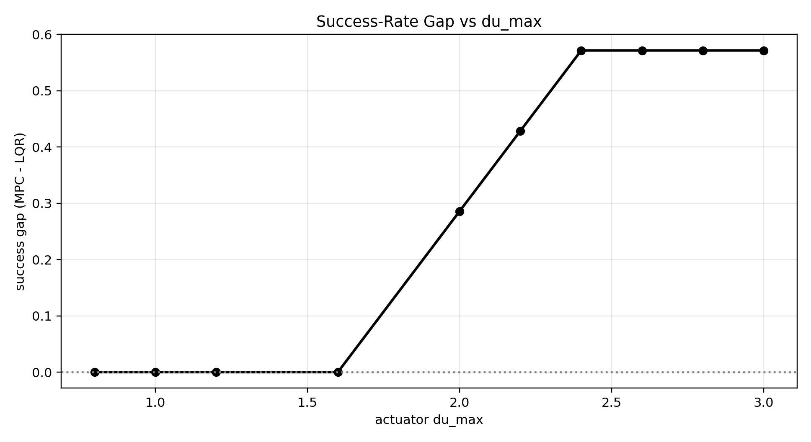
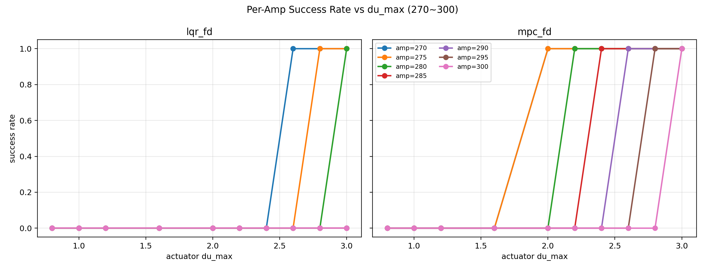

# Control Bench

MuJoCo 도립진자 환경에서 `LQR`과 `constrained MPC`를 직접 구현하고, 같은 외란과 같은 제약 조건 아래에서 두 제어기가 어떻게 다르게 실패하는지 비교한 포트폴리오 레포지토리입니다.

## 문제 설정

관심사는 단순한 제어 성능 비교가 아니라 다음과 같습니다.

- 제약이 없을 때 MPC가 정말 LQR과 같은 입력을 내는지
- `x`, `u`, `delta u` 제약이 활성화될 때 둘의 차이가 어디서 발생하는지
- 지연과 센서 노이즈가 추가되면 어떤 실패 모드가 먼저 드러나는지

이 레포는 그 질문을 재현 가능한 실험 코드, 플롯, 보고서로 정리합니다.

## 핵심 결과

- 무제약 조건에서는 `terminal cost = DARE P`인 선형 MPC가 LQR과 수치 오차 수준으로 일치했습니다.
- 전이 구간에서는 차이가 분명해졌습니다. 특히 `|x| <= 1`, `|u| <= 3`, `|delta u| <= 2.6` 조건에서 LQR은 rail limit에 먼저 걸리는 반면 MPC는 미래 상태 제약을 예측에 넣어 더 강한 외란까지 버팁니다.
- `delta u`는 임의로 잡지 않았습니다. high-amp 구간에서 sweep을 돌려, 두 제어기의 차이가 가장 정보량 있게 드러나는 대표값으로 `du_max = 2.6`을 선택했습니다.

## 대표 결과

센서 노이즈 `0.01`을 넣었을 때의 제약 활성 빈도와 마진입니다:



센서 노이즈 `0.01` 환경에서의 상태/입력 시계열 예시입니다:



입력 지연 `2-step`을 넣었을 때의 성공률과 실패 원인 분리입니다:



이상적 조건에서 `du_max` 선택 근거입니다. 값이 너무 작으면 둘 다 실패하고, 너무 크면 둘 다 성공해서 차이가 흐려집니다:



이상적 조건에서 amp별로 봐도 같은 경향이 유지됩니다:



## 빠른 실행

환경 준비:

```bash
python -m venv .venv
source .venv/bin/activate
pip install -r requirements.txt
```

헤드리스 환경에서 비디오 렌더링이 필요하면 `MUJOCO_GL=egl`를 사용합니다. `smoke_mujoco.py`는 이 값을 기본으로 설정합니다.

MuJoCo 스모크 테스트:

```bash
python smoke_mujoco.py
```

빠른 비교 실행:

```bash
python -m experiments.fd_compare.eval_sweep_fd_compare \
  --mode metrics \
  --controllers lqr_fd,mpc_fd \
  --amps 250,275 \
  --seeds 3 \
  --disturbance-kind window \
  --t0 100 \
  --duration 5 \
  --theta0 0 \
  --termination-theta 1.5708 \
  --termination-x-limit 1.0 \
  --x-fail-limit 1.0 \
  --x-fail-eps 0.0 \
  --x-fail-hold 1 \
  --actuator-u-max 3.0 \
  --actuator-u-min -3.0 \
  --actuator-du-max 2.6 \
  --metric-du-threshold 2.6 \
  --sat-tol 0.02 \
  --steps 250 \
  --step-log-dir logs/fd_compare/steps_quick \
  --out logs/fd_compare/summary_quick.csv
```

플롯 생성:

```bash
python -m experiments.fd_compare.plot_fd_compare \
  --csv logs/fd_compare/summary_quick.csv \
  --outdir plots/fd_compare_quick \
  --step-log-dir logs/fd_compare/steps_quick \
  --u-seed 0
```

더 긴 재현 절차와 figure-grade 실행 명령은 [docs/reproduction.md](docs/reproduction.md)에 정리했습니다.

## 레포 구조

```text
controllers/         LQR, MPC, actuator limiter
envs/                MuJoCo environment factory and wrappers
experiments/         benchmark, plotting, sanity checks, tuning scripts
docs/                report, methodology, reproduction notes
assets/figures/      README에 직접 쓰는 대표 이미지
```

## 문서

- [docs/report.md](docs/report.md): 프로젝트 동기, 실험 설정, 핵심 해석
- [docs/methodology.md](docs/methodology.md): 모델링, 제약, 지표, sanity check 정리
- [docs/reproduction.md](docs/reproduction.md): 환경 준비, 벤치마크 실행, 플롯 재현 절차

## 구현 포인트

- [controllers/lqr.py](controllers/lqr.py): DARE 기반 discrete LQR과 이론 모델 이산화
- [controllers/mpc.py](controllers/mpc.py): condensed linear MPC with input, rate, state constraints
- [experiments/fd_compare/run_fd_compare.py](experiments/fd_compare/run_fd_compare.py): 공정 비교용 메인 rollout 엔진
- [experiments/fd_compare/eval_sweep_fd_compare.py](experiments/fd_compare/eval_sweep_fd_compare.py): sweep 실행과 메트릭 CSV 생성
- [experiments/fd_compare/plot_fd_compare.py](experiments/fd_compare/plot_fd_compare.py): aggregate plot 생성
- [experiments/fd_compare/sanity_unconstrained_mpc.py](experiments/fd_compare/sanity_unconstrained_mpc.py): 무제약 MPC=LQR 검증

## 한계와 다음 단계

- 현재 메인 실험은 선형화 기반 MPC입니다. 비선형 MPC나 estimator는 아직 포함하지 않았습니다.
- 실험 대상은 단일 MuJoCo 도립진자 환경에 집중되어 있습니다.
- 다음 단계는 `state estimator`, `model mismatch`, `cost sensitivity`, `different horizons` 비교를 추가하는 것입니다.
