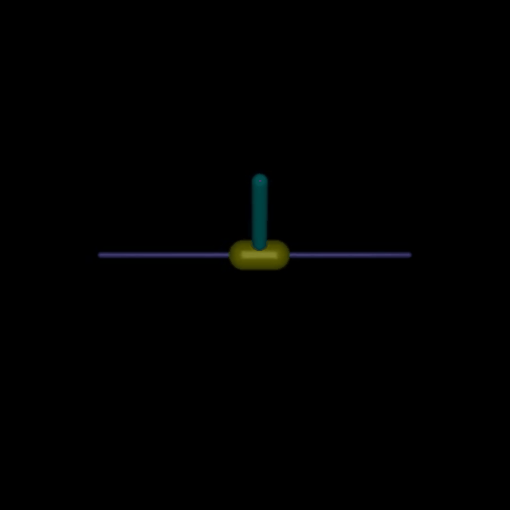
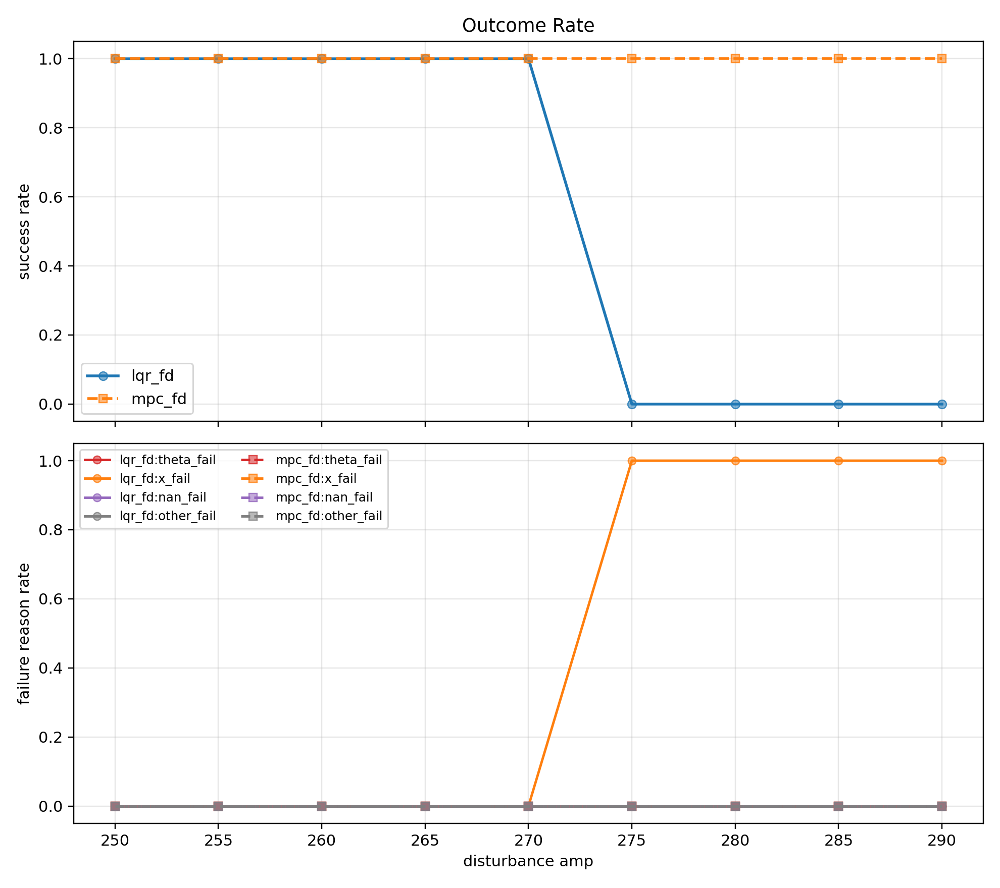
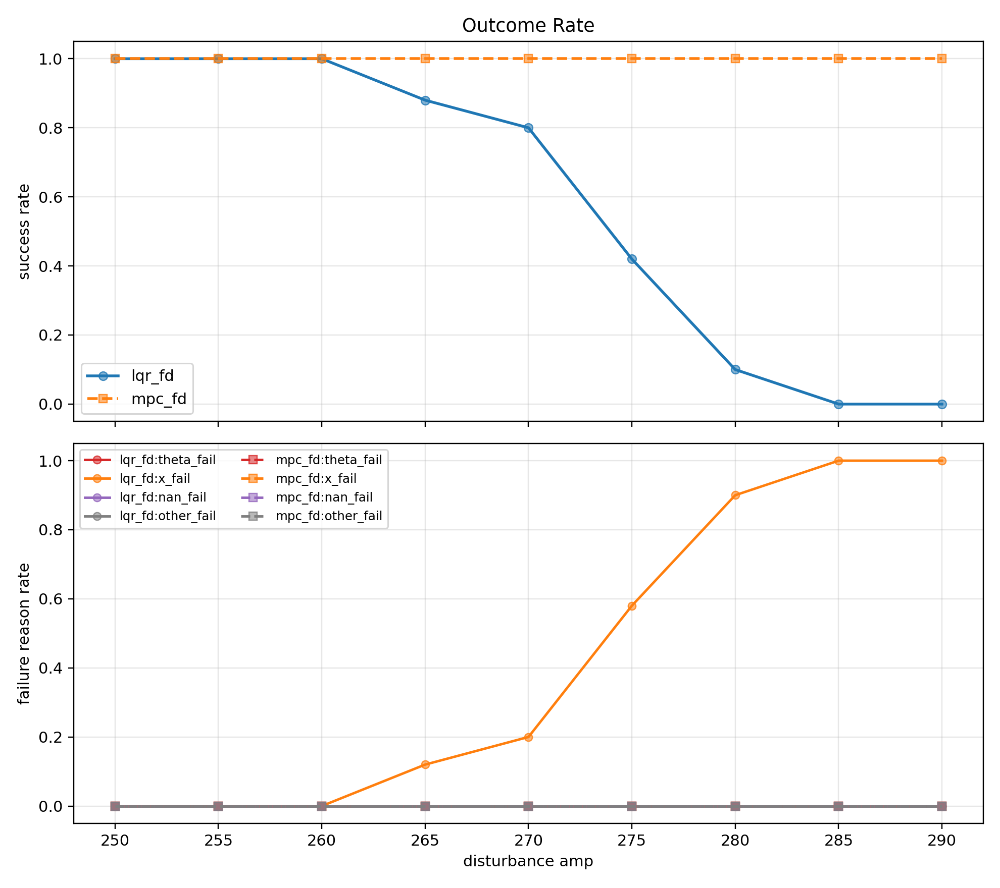
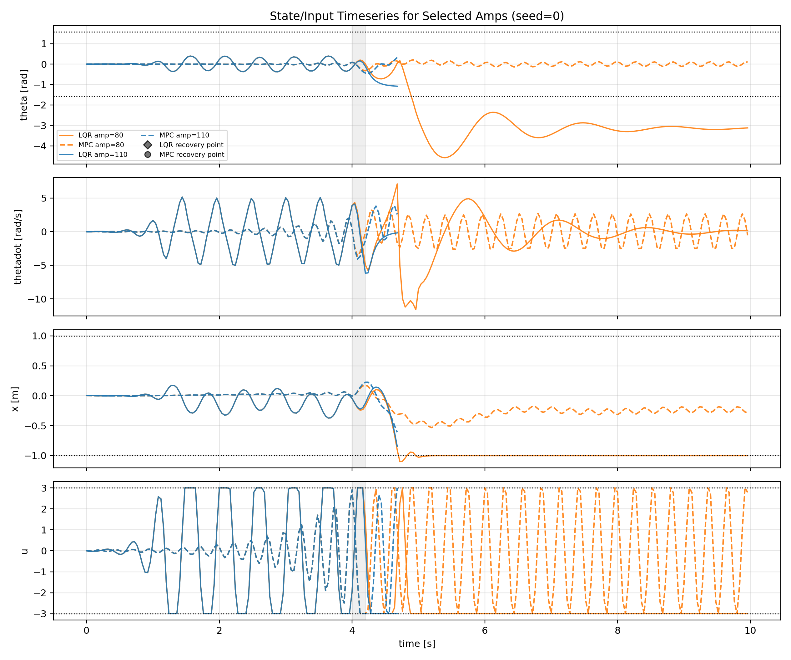

# Control Bench

> MuJoCo 도립진자에서 `LQR`과 제약을 포함한 `MPC`를 같은 외란과 같은 제약 아래 비교한 제어 벤치마크.

|  |  |
|---|---|
|  |  |
| [그림1] 기본 조건, `amp = 275`, `seed = 0`에서의 `LQR` 동작 장면. 레일 한계에 걸리며 위치 한계 초과로 종료된다. | [그림2] 기본 조건, `amp = 275`, `seed = 0`에서의 `MPC` 동작 장면. 같은 외란에서 끝까지 복귀에 성공한다. |

## 개요
MuJoCo `InvertedPendulum-v5`에서 유한차분 선형화로 동일한 `Ad`, `Bd`, `Q`, `R`를 공유하는 `LQR`과 `MPC`를 직접 구현했다.  
비교 기준은 실패 양상과 제약 활성 패턴이다. 먼저 무제약 기초 검증으로 구현이 맞는지 확인하고, 큰 외란 구간에서 `du_max` 비교 실험을 돌려 두 제어기의 차이가 가장 잘 드러나는 전이 구간을 골랐다.

## 핵심 수식
두 제어기는 같은 선형화 모델과 같은 비용함수를 공유한다.

```math
x_{k+1} = A_d x_k + B_d u_k
```

```math
J = \sum_{k=0}^{N-1} \left( x_k^\top Q x_k + u_k^\top R u_k \right)
```

차이는 `MPC`가 예측 구간 안에서 다음 제약을 직접 다룬다는 점이다.

```math
|u_k| \le u_{\max}, \quad |\Delta u_k| \le \Delta u_{\max}, \quad |x_k| \le x_{\max}
```

## 구현 내용
- MuJoCo 상태천이에서 `Ad`, `Bd`를 유한차분으로 추정하고, 이산 `LQR`을 계산했다.
- 입력·상태 제약을 함께 다루는 선형 `MPC`를 구현해 `u`, `delta u`, `x` 제약을 예측 구간 안에서 직접 처리했다.
- 외란, 입력 지연, 센서 노이즈 래퍼와 반복 실험·시각화 코드를 붙여 같은 조건에서 두 제어기를 비교했다.

## 결과

기본, 각도 노이즈 `0.005`, 각도 노이즈 `0.01` 조건에서 MPC는 평균 성공률 `100%`를 유지한 반면, LQR은 `55.6~57.8%`에 머물렀다. 반대로 지연 `2-step`에서는 두 제어기 모두 거의 붕괴했다.

평균 성공률은 각 비교 구간 전체 `amp`에 대한 평균이고, `100% 성공 최대 amp`는 성공률 `1.0`을 유지한 마지막 외란 크기다.

| 케이스 | amp (N) 범위 | LQR 평균 성공률 | MPC 평균 성공률 | 100% 성공 최대 amp (N) (LQR / MPC) | 주 실패 모드 (LQR / MPC) |
|------|-----------|----------------|----------------|-------------------------------|--------------------------|
| 기본 | `250~290` | `55.6%` | `100.0%` | `270 / 290` | `x / theta` |
| 지연 1-step | `50~275` | `62.0%` | `69.8%` | `100 / 125` | `x / other` |
| 지연 2-step | `80~120` | `6.0%` | `5.2%` | `- / -` | `x / theta` |
| 각도 노이즈 `0.005` | `250~290` | `57.1%` | `100.0%` | `265 / 290` | `x / theta` |
| 각도 노이즈 `0.01` | `250~290` | `57.8%` | `100.0%` | `260 / 290` | `x / theta` |

기본 조건에서 평균 `u` 제약 활성률은 `LQR 2.77%`, `MPC 1.89%`였고, 평균 `du` 제약 활성률은 `LQR 0.58%`, `MPC 0.40%`였다.

<p align="center">
  
</p>

[그림3] 이상적 조건의 성공률·실패 원인 그래프. 입력 지연이 없고 각도 노이즈도 없는 조건에서 외란 크기(`amp`)에 따라 `LQR`과 `MPC`의 성공률이 달라지는 것을 보여준다.

<p align="center">
  
</p>

[그림4] 각도 노이즈 `0.01` 조건의 성공률·실패 원인 그래프. 노이즈가 들어간 뒤에도 `MPC`는 전 구간에서 성공률 `100%`를 유지하고, `LQR`은 외란이 커질수록 빠르게 무너진다.

<p align="center">
  
</p>

[그림5] 지연 `2-step` 조건의 시계열 그래프. `seed = 0`에서 선택된 외란 크기에 대한 상태·입력 응답을 비교한 것으로, 지연이 커지면 두 제어기 모두 빠르게 불안정해지는 모습을 보여준다.

기본 조건과 각도 노이즈 조건에서는 MPC의 이점이 분명했고, 지연이 `2-step`까지 커지면 두 제어기 모두 급격히 불안정해졌다.

## 한계
- 메인 비교는 선형화 기반 `LQR`과 선형 `MPC`에 집중되어 있어 비선형 `MPC`나 상태추정기는 포함하지 않았다.
- 실험 대상이 단일 MuJoCo 도립진자 환경에 한정되어 있어 일반화 범위는 제한적이다.

자세한 해석은 [docs/report.md](docs/report.md), 지표 정의는 [docs/methodology.md](docs/methodology.md), 재현 절차는 [docs/reproduction.md](docs/reproduction.md)에 정리했다.
